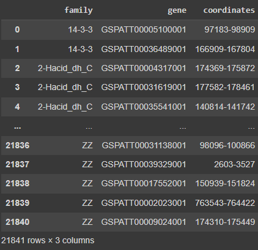
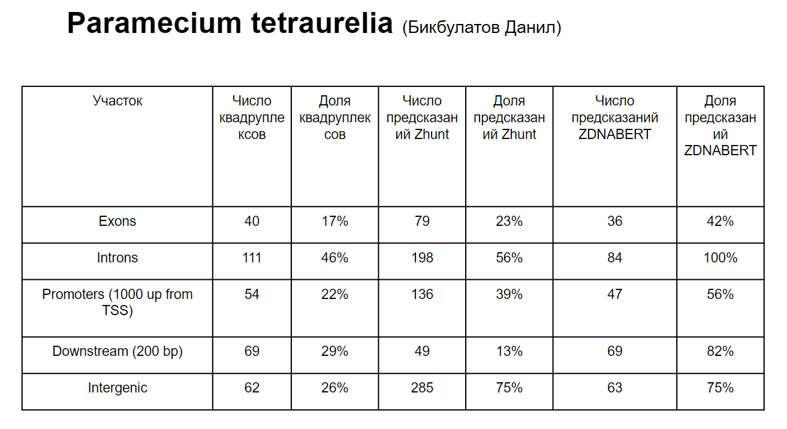

# bioinf_project
## Ссылка на колаб:
# 1 часть 
https://colab.research.google.com/drive/1NzYMNEgFnxQrKDlPPeXx7lz3ffclB90B?usp=sharing
# 2 часть
https://colab.research.google.com/drive/1NzYMNEgFnxQrKDlPPeXx7lz3ffclB90B?usp=sharing

## Файлы zscore, genomic.gff, GCF_000165425.1_ASM16542v1_genomic.fna
Файлы слишком большие, поэтому были загружены на Google disk. 
https://drive.google.com/drive/folders/19QbrouAfeg5mujYxYoeeF_sn4RUyAMgB?usp=sharing

## Таблица семейства ген

## Таблица с найденными структурами
